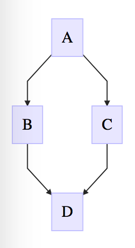

# PROJECT UNMAINTAINED
# Attina 🐟

Mermaid react renderer compatible with React 15.5+ based off [React Mermaid](https://github.com/jasonbellamy/react-mermaid)

Uses [Mermaid](https://mermaidjs.github.io/mermaidAPI.html) under the hood

## Setup

Install with:

```shell
$ yarn add attina
```

## Usage

```js
<Attina
  diagram={`
    graph TD;
    A-->B;
    A-->C;
    B-->D;
    C-->D;`}
/>
```

Will produce the following output:



## Demo

You can modify this example on codesandbox:

[](https://codesandbox.io/s/7jqo862n7j)
